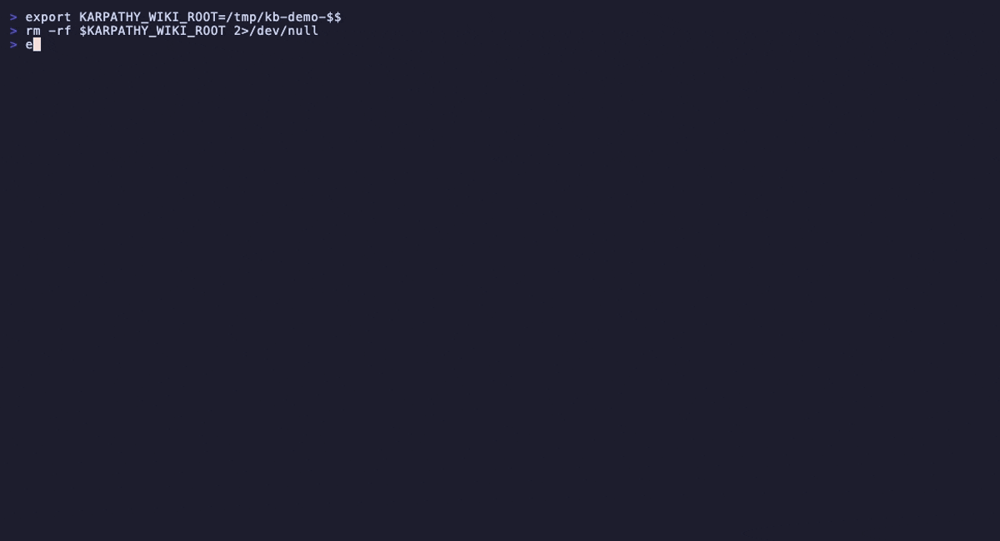
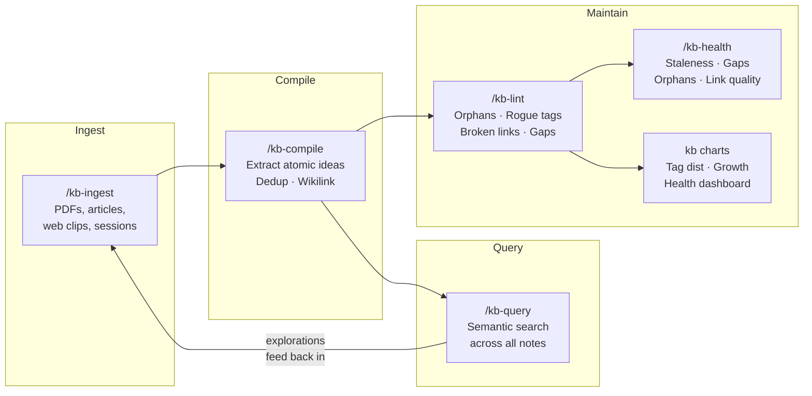
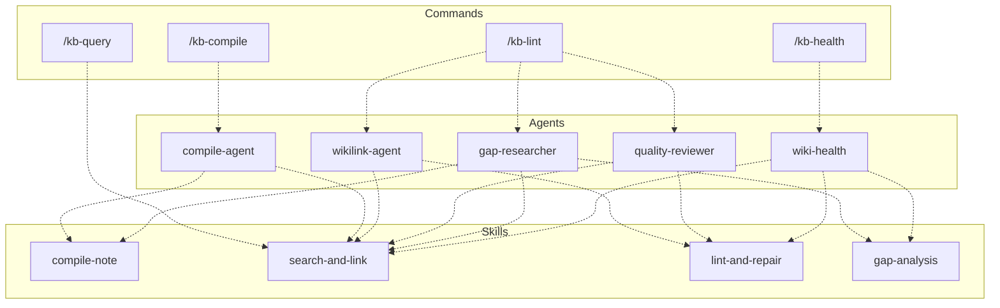

# karpathy-llm-wiki

An implementation of [Andrej Karpathy's LLM knowledge base workflow](https://x.com/karpathy/status/2039805659525644595) as a Claude Code plugin.

> *"Something I'm finding very useful recently: using LLMs to build personal knowledge bases for various topics of research interest. [...] Raw data from a given number of sources is collected, then an LLM incrementally compiles a wiki from it, which you can then query, visualize, and lint."*
> — Andrej Karpathy

## Demo



## The Idea

Karpathy described a workflow where raw documents (articles, papers, repos) are indexed into a `raw/` directory, then an LLM **incrementally compiles a wiki** from them — extracting concepts, writing articles, adding backlinks, and maintaining the whole thing. You query it, explore it, lint it, and your explorations feed back in, so your knowledge always "adds up."

This plugin implements that full loop as a set of Claude Code commands.

## The Workflow



## Install

```bash
claude plugin add code.aws.dev/proserve/product-and-solutions/tools/knowledge-management/second-brain-plugins --plugin karpathy-llm-wiki
```

Then initialize a wiki in any directory:

```bash
mkdir my-knowledge-base && cd my-knowledge-base
/kb-init
```

### Environment Variable

Set `KARPATHY_WIKI_ROOT` so the CLI can find your wiki from any directory:

```bash
export KARPATHY_WIKI_ROOT=~/Projects/my-wiki
```

Add this to `.envrc` (with [direnv](https://direnv.net/)) or your shell profile for persistence.

Without this variable, the CLI walks up from your current directory looking for `.kb-config.yml`.

### Scheduled Maintenance

Enable a daily cron job that rebuilds the vector index and generates charts:

```bash
kb maintenance enable    # installs cron job
kb maintenance status    # check if active
kb maintenance disable   # remove cron job
```

## Commands

| Command | What it does |
|---------|-------------|
| `/kb-init` | Scaffold a new wiki: directories, config, tag taxonomy, .gitignore |
| `/kb-ingest` | Route raw documents into the pipeline (PDF, markdown, web, text, session logs) |
| `/kb-compile` | The core loop: read raw docs, extract atomic ideas, check for duplicates, write permanent notes with frontmatter and wikilinks |
| `/kb-query` | Semantic search across all notes using vector embeddings |
| `/kb-lint` | Health checks: orphaned notes, broken links, rogue tags, knowledge gaps |
| `/kb-health` | Comprehensive wiki diagnostic — staleness, gaps, orphans, link quality |
| `/kb-index` | Rebuild the LanceDB vector index (full or incremental) |

## Agents

The plugin includes 4 autonomous agents that can work on your wiki independently:

| Agent | What it does |
|-------|-------------|
| **compile-agent** | Processes all pending inbox items end-to-end: reads raw docs, extracts atomic ideas, deduplicates, writes notes with wikilinks, updates the index |
| **gap-researcher** | Analyzes your wiki for knowledge gaps (underrepresented tags, missing topic bridges), then researches and creates notes to fill them |
| **wikilink-agent** | Scans for orphaned notes and adds meaningful `[[wikilinks]]` to connect them into a knowledge graph |
| **quality-reviewer** | Audits recently compiled notes for accuracy, proper tagging, confidence calibration, and connection quality |
| **wiki-health** | Runs a full 5-phase diagnostic (baseline, staleness, gaps, link health, report) and produces an actionable health report |

These agents can be dispatched to work in the background while you continue other work. They're the "maintenance crew" that keeps your wiki healthy and interconnected.

## Skills

Skills are reusable knowledge modules that both commands and agents invoke. They eliminate duplication — the "how to do X" lives in one place.

| Skill | What it knows |
|-------|--------------|
| **compile-note** | Extracting atomic ideas, dedup checking, writing notes with frontmatter |
| **search-and-link** | Finding related notes via semantic search, adding meaningful `[[wikilinks]]` |
| **lint-and-repair** | Running health checks, interpreting results, conservative auto-repair |
| **gap-analysis** | Identifying underrepresented tags/types, missing bridges, research questions |



**Commands** are interactive (you invoke them, you stay in the loop). **Agents** are autonomous (dispatch them, they work independently). **Skills** are the shared knowledge both use.

## How It Works

### Notes are atomic

Each wiki note captures **one idea** with structured YAML frontmatter:

```yaml
---
id: perm-20260409-a1b2c
type: permanent
knowledge_type: pattern    # fact | pattern | decision | correction | idea | design | exploration
status: accepted
confidence: high           # high | medium | low
scope: universal           # universal | project | temporal
tags:                      # up to 6 from approved taxonomy
  - architecture
  - llm
  - agent-patterns
source: "compiled from: ingest-f422cad5"
created: "2026-04-09"
---

The actual insight goes here, with [[wikilinks]] to related notes.
```

### Deduplication is automatic

When compiling, every new idea is checked against the existing wiki using cosine similarity on sentence embeddings:

- **>= 0.92**: Duplicate — automatically skipped
- **0.80 - 0.91**: Similar — flagged for your review
- **< 0.80**: Unique — written to the wiki

### Search is semantic, not keyword

```bash
/kb-query "How should agents authenticate on behalf of users?"
```

Uses [LanceDB](https://lancedb.com/) with `all-MiniLM-L6-v2` embeddings for local-first vector search. No API keys, no cloud services, everything runs on your machine.

### Gap analysis feeds back in

```bash
/kb-lint --explore
```

Analyzes your wiki for knowledge gaps: underrepresented tags, missing knowledge types, disconnected clusters, and generates follow-up questions. Research the answers, ingest them, compile — the loop continues.

## Architecture

```
my-wiki/
├── .kb-config.yml          # Central config (all paths, thresholds)
├── wiki/
│   ├── permanent/          # Your knowledge base (flat, no hierarchy)
│   ├── _index/             # Created on first `kb index` run
│   └── _meta/
│       ├── tag-taxonomy.md # 17 approved tags, 7 knowledge types
│       └── stats.md        # Auto-generated by `kb charts`
├── raw/
│   ├── inbox/              # Staging area + .manifest.json
│   ├── artifacts/          # Ingested files (PDFs, etc.)
│   ├── sessions/           # Claude Code session logs
│   └── web/                # Web clips
├── output/
│   ├── reports/            # Lint reports, gap analyses
│   └── charts/             # Matplotlib visualizations
└── .lancedb/               # Vector index (auto-generated, gitignored)
```

**Key design choices:**

- **Flat storage** — all notes in `wiki/permanent/`, no directory hierarchy. Discovery is through semantic search, not folders.
- **Local-first** — LanceDB is embedded, sentence-transformers runs locally. No external services.
- **Obsidian-compatible** — notes use `[[wikilinks]]` and YAML frontmatter. Open the wiki directory in Obsidian and everything renders. But Obsidian is not required.
- **CLI-first** — the `kb` CLI handles all mechanical work. Claude Code commands orchestrate the intelligence.

## Tech Stack

- **Python 3.11+** with [Typer](https://typer.tiangolo.com/) CLI
- **LanceDB** for vector storage and search
- **sentence-transformers** (`all-MiniLM-L6-v2`) for local embeddings
- **matplotlib** for visualizations
- **PyYAML** for frontmatter parsing

## Development

```bash
cd plugins/karpathy-llm-wiki/llm-wiki-core
uv sync
uv run kb --help
uv run pytest -v
```

## Credits

This plugin implements the workflow described by [Andrej Karpathy](https://x.com/karpathy/status/2039805659525644595). The idea is his; the implementation is ours.

## License

MIT
